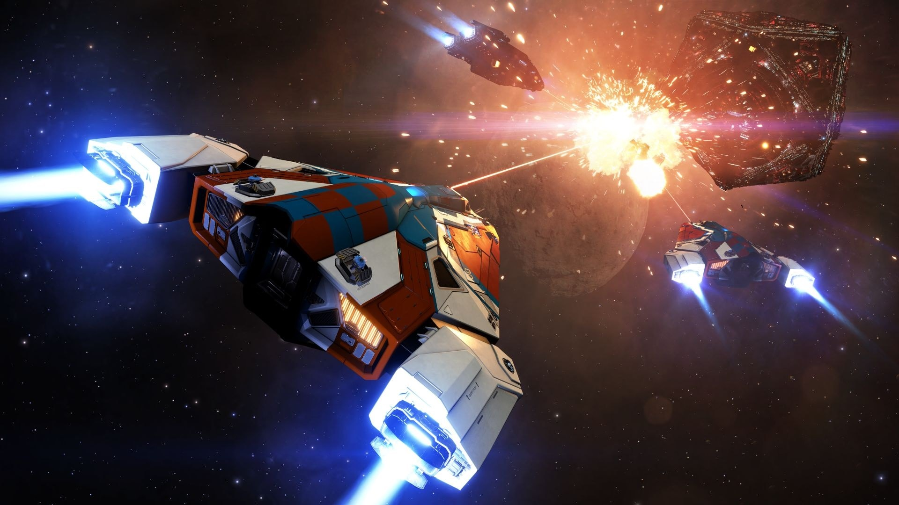
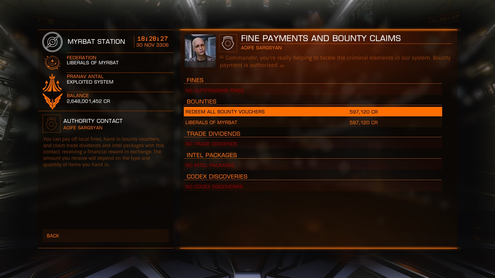

{/* https://jsongpt.com/converter/url-to-markdown */}

V každém obydleném systému, kde je nejmenší náznak obchodní činnosti se budou také vždy vyskytovat piráti, kteří přepadají nákladní a těžební lodě. Často nemají ochranné složky dost kapacit na ochranu všech obchodníků a těžařů, a proto spoléhají na bounty huntery neboli lovce odměn. Cílem lovců odměn jsou hledaní piloti, na které je vypsána odměna. Pokud se lovci podaří zničit hledaného piráta, může si na něj vypsanou odměnu vyzvednout na stanici ve zdejším systému.

### Kde najdu hledané piloty?

V následujících lokacích:

- Nav Beacon
- Resource extraction site (zkráceně RES)
  - RES (Low) – nízký výskyt pirátů + přítomnost bezpečnostních složek
  - RES – střední výskyt pirátů + přítomnost bezpečnostních složek
  - RES (High) – vysoký výskyt pirátů + přítomnost bezpečnostních složek
  - RES (Hazardous) – velmi vysoký výskyt pirátů BEZ přítomnost bezpečnostních složek
- Signal sources (zkráceně USS)
  - Možnost výskytu pirátů ve všech, které mají threat level vyšší jak 0 … např. Weapons Fire (threat 2)
- Supercruise
  - Hledané piloty lze vytahovat rovnou ze supercruisu pomocí [FSD interdictoru][13]

Výši odměny vypsané na hledaného pilota najdeme v levém panelu v kontaktech, když si rozklikneme jeho loď (Bounty).

### Kde si mohu odměnu vyzvednout?

Tato odměna se vztahuje a je vyplácena pouze v daném systému, nebo v systémech, které ovládá stejná Frakce.

#### Příklad

Jsme v systému xyz ve kterém se nachází plynný obr xyz s prstenci. V těchto prstencích se nachází Resource extraction site (High) kde chceme lovit piráty. Skočíme do RESky a po chvíli nás začínají skenovat lodě. Pokud s vámi při skenování komunikují skrz chat. Jedná se pravděpodobně o piráty. Abychom si ověřili, zda jsou opravdu hledaní, targetneme/označíme si je a natočíme se k nim. Automaticky se spustí scan který trvá cca 5 sekund a po jehož dokončení uvidíme na [Target Panelu][14] jeho status. Clean, Wanted nebo Lawless.

Pokud je pilot Wanted, můžeme ho oskenovat Kill Warrant Scannerem pro větší odměnu. Poté co se nám podaří loď hledaného pilota zničit, získáme odměnu, která na něj byla vypsána. Přehled o celkovém množství sesbíraných odměn najdeme v [Navigations Panelu][15] v záložce Transactions. V našem případě xyz creditů. Tuto odměnu si následně letíme vyzvednout na zdejší stanici ve [Station services][16]\-&gt; Contacts -&gt; Systém Authority Contact.

### Výbava

###### Nutná výbava:

- [Zbraně][17]

###### Doporučená výbava:

- [Shield generátor][18] - (Větší výdrž lodi v boji)
- Kill warrant scanner (zkráceně KWS) - (Po oskenování zvyšuje výši odměny hledané lodi)
- [FSD interdictor][19] - (umožňuje vytahovat hledané lodě rovnou ze supercruisu)

###### Pro tipy:

- **POZOR: Pokud je vaše loď jakýmkoliv způsobem zničena, přicházíte o veškeré nevyzvednuté peníze!**
- Pokud lovíte ve [wingu][20], odměnu získává každý, kdo se podílí na zničení hledané lodi a zasáhne ji před zničením.
- Nemějte při lovení hledaných pilotů **ŽÁDNÝ NÁKLAD.**
- Resource extraction site najdeme ve většině prstenců planet.
- Pokud lovíte sami a nevěříte si napadnout hledaného pilota. Počkejte, než na něj zaútočí bezpečnostní složky a až poté se přidejte. NPC ve většině případech útočí na pilota, který na něj zaútočí jako první.
- Never fly without rebuy!

### Videá

<iframe
  width="100%"
  src="https://www.youtube.com/embed/K-fKJYMD7Zw?si=I68PMVeDNZDE2A3x"
  title="YouTube video player"
  frameborder="0"
  allow="accelerometer; autoplay; clipboard-write; encrypted-media; gyroscope; picture-in-picture; web-share"
  referrerpolicy="strict-origin-when-cross-origin"
  allowfullscreen
  style="aspect-ratio: 16 / 9"
></iframe>

[1]: https://elitehub.eu/index.php
[2]: https://elitehub.eu/index.php
[3]: https://elitehub.eu/article.php?a=bountyHunting#
[4]: https://elitehub.eu/odyssey.php
[5]: https://elitehub.eu/engineers.php
[6]: https://elitehub.eu/article.php?a=bountyHunting#
[7]: https://elitehub.eu/beginners.php
[8]: https://elitehub.eu/article.php?a=bountyHunting#Uvod
[9]: https://elitehub.eu/article.php?a=bountyHunting#Kde
[10]: https://elitehub.eu/article.php?a=bountyHunting#Priklad
[11]: https://elitehub.eu/article.php?a=bountyHunting#Vybava
[12]: https://elitehub.eu/article.php?a=bountyHunting#Videa
[13]: https://elitehub.eu/article.php?a=interdikcie
[14]: https://elitehub.eu/article.php?a=interface#Target-panel
[15]: https://elitehub.eu/article.php?a=interface#Navigation-panel
[16]: https://elitehub.eu/article.php?a=stationServices
[17]: https://elitehub.eu/article.php?a=weapons
[18]: https://elitehub.eu/article.php?a=shields
[19]: https://elitehub.eu/article.php?a=interdikcie
[20]: https://elitehub.eu/article.php?a=wings
[21]: https://www.paypal.com/donate?hosted_button_id=L2XF7BBEJB8WE&source=url
[22]: https://elitehub.eu/article.php?a=stationServices
[23]: https://elitehub.eu/article.php?a=interdikcie
[24]: https://elitehub.eu/article.php?a=interface
[25]: https://discord.gg/a7Zsx6a
[26]: https://www.youtube.com/channel/UCRxMAY5KbBh_RsKhxbefeLg
[27]: https://www.paypal.com/donate?hosted_button_id=L2XF7BBEJB8WE&source=url
[28]: https://elitehub.eu/patchNotes.php
