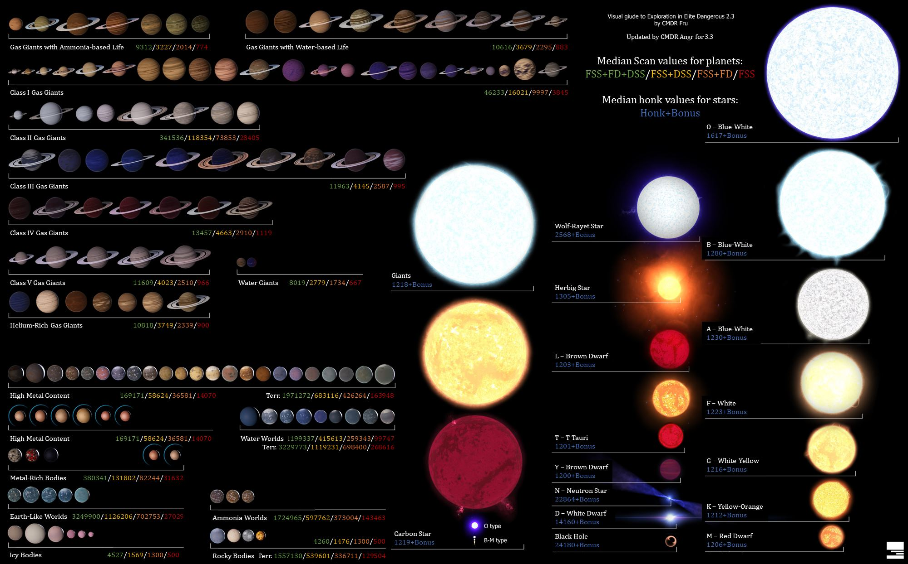

Galaxie v Elite Dangerous obsahuje 400 000 000 000 slunečních systémů, obydlená je však pouze malá část (Bublina a \***\*Colonia\*\***). Exploring je tudíž jednou z nejzákladnějších činností. Cílem explorerů jsou výpravy do neprozkoumaných částí galaxie a objevování nových slunečních systémů, planet a fenoménů.

## Skenování stelárních objektů

Ke skenování stelárních objektů jako jsou planety, hvězdy a zdroje signálů se používá **discovery scanner** a **full spectrum system scanner** (každá loď je má automaticky zabudované). Pro použití skenerů musíme změnit mód kokpitu do **analysis módu** (UI kokpitu by mělo být modré).

### Discovery scanner:

Pro použití ho přiřadíme do námi zvolené [fire group](./article.php?a=fireGroups) a použijeme stejně jako zbraň. Po použití odhalí všechny signály stelárních objektů v systému a jejich pozici. Tento proces skenování se nazývá **"Honk".**

_obr. 1 Správa po "honku"_

Abychom nyní zjistili, o které stelární objekty se jedná a znali jejich detaily, musíme tyto signály oskenovat **full spectrum system scannerem.**

### Full spectrum system scanner (FSS):

Před prvním použitím si musíme v nastavení ovládání hry nastavit ovládání FSS UI. Když otevřeme FSS UI, vidíme v [info panelu](./article.php?a=interface#Info-panel) počet detekovaných signálů a kolik z těchto signálů představuje **planety** a hvězdy. Zbylé signály jsou **unidentified signal sources** (USS).

_obr. 2 Interface FSS_

Pod "zaměřovačem" scanneru máme lištu s názvem **"Filtered spectral analysis"**. Tato lišta nám dává přehled o síle signálů (**USS jsou nejslabší a plynní obři nejsilnější**).

_obr. 3 Pomůcka pro diagram_

### Skenování

Abychom nyní signály úspěšně oskenovali, musíme posunout náš ukazatel na liště do bodu, který je vyznačen signálem (čára není rovná, ale jsou na ní výstupky). Dále musíme namířit zaměřovač našeho scanneru na daný signál, který najdeme pomocí **bílých šipek** a **modrých fleků.** Po lokalizování správneho signálu použijeme **"zoom in to target"** (někdy je potřeba zoomovat víckrát a potunit spectral analysis lištu).

_obr. 4 Planeta po úspěšném skenu_

Objekt je úspěšně oskenován, jakmile se nám zobrazí jeho název, typ a detaily podobně jako na výše uvedeném obrázku.

## Mapování planet

Pro mapování planet potřebujeme v optional internals zabudovat **Detailed Surface Scanner** (DSS). Ten musíme pro použití opět přiřadit do fire groups a v nastavení ovládání nabindovat ovládání.

Mapování funguje na základě vysílání sond na povrch planet nebo do jejich prstenců.

### Postup:

Vybereme si planetu kterou chceme zmapovat a přiletíme v **supercruisu** do její blízkosti. Pro použití DSS musíme změnit **mód kokpitu** stejně jako u **discovery scanneru** do **analysis módu** a použijeme podobně jako zbraně.

Pokud jsme dostatečně blízko planety, kterou chceme mapovat, otevře se nám po použití DSS nové UI. Pomocí toho vystřelíme sondy směrem k planetě.

_obr. 5 Mapovací interface_

Aby byla planeta kompletně zmapována, musíme sondami pokrýt **90%** povrchu planety (abychom pokryli povrch i na nám odvrácené straně planety můžeme využít gravitace planety).

Abychom zmapovali **prstence** planety, stačí nám vstřelit jednu sondu do prstence.

\***\*Pozor: Některé planety mají více prstenců, tudíž je nutné mapovat každý zvlášť.\*\***

## Odměny

Skenování i mapování nám dává finanční odměnu, která závisí na typu planety. Jak velkou odměnu za který druh planety dostaneme, najdeme [ZDE.](https://elite-dangerous.fandom.com/wiki/Explorer#Exploration_Data) Pokud je planeta kandidátem na terraformování (terraformable), dostaneme za ni větší odměnu, než za ostatní stejného typu.

Pokud jsme první, kteří planetu objevili dostaneme **trojnásobek** klasické odměny za objevení. Mapování planet zvyšuje hodnotu odměny cca **čtyřnásobně.**

_obr. 6 Odměny za exploration - [link](http://elitedangerous.hozbase.co.uk/images/utility/HowMuchIsItWorth.jpg)_

## Výbava

### Loď

Vzhledem k tomu, že jedním z hlavních principů exploringu je cestování na velké vzdálenosti, budeme potřebovat loď, která je tohoto úkolu schopná. Explorovat se dá v jakékoliv lodi, avšak, pokud při tom nechcete zestárnout, doporučujeme následující lodě:

-   Anaconda
-   Asp Explorer
-   Beluga Liner
-   Diamondback Explorer
-   Dolphin
-   Hauler
-   Krait Phantom
-   Orca

Nejčastěji používané lodě jsou Anaconda, Asp Explorer a Diamondback Explorer.

### Outfitting

Při cestování do neznáma budeme potřebovat [fuel scoop,](./article.php?a=fuelScooping) protože cestujeme mimo obývané systémy. Abychom si zkrátili cestu budeme chtít ten nejlepší možný **Frame-Shift Drive.** Pro zvýšení doskoku je taktéž doporučené odstranit všechny moduly (např. zbraně), které na naší cestě nebudeme potřebovat. Moduly, které budeme potřebovat, vyměníme za moduly třídy D, protože mají nejnižší váhu pro danou velikost. To nám pomůže dále navýšit doskok naší lodi.

Také nesmíme zapomenout na **Detailed Surface Scanner (DSS),** abychom mohli mapovat planety. Pokud budeme chtít navštívit zajímavé místa na planetách (např. gejzíry, mini-sopky, kristaly, apod.), budeme potřebovat **SRV.**

#### Nutná výbava:

-   **Nejlepší možný Frame-Shift Drive (FSD)**
-   **Detailed Surface Scanner**
-   [Fuel scoop](./article.php?a=fuelScooping)

#### Doporučená výbava

-   **SRV**
-   **Auto Field-Maintenance Units** - oprava modulov na ceste, nemajú váhu
-   [Heat sinky](./article.php?a=heatsinkLauncher)
-   [Štíty](./article.php?a=shields)
-   **Guardian Frame Shift Drive Booster**

### Engineering

Pro maximální efektivitu doporučujeme upravit některé moduly u engineera tak, aby měly co nejmenší hmotnost, spotřebu energie a negenerovaly tolik tepla.

###### **Doporučené úpravy:**

-   Power Plant: _Low Emissions_ pro nižší teplotu
-   Thrusters: _Clean Drives_ pro nižší teplotu
-   Zbraně a utilities: _Lightweight_
-   Štíty: _Reinforced_ nebo _Enhanced low power_
-   Power Distributor: _Engine Focused_ aby bylo možné boostit i když nemáme dostatečně velký power distributor

## Videa

[TODO: Embed https://www.youtube.com/embed/9wqbmvvuiuk](https://www.youtube.com/embed/9wqbmvvuiuk)
